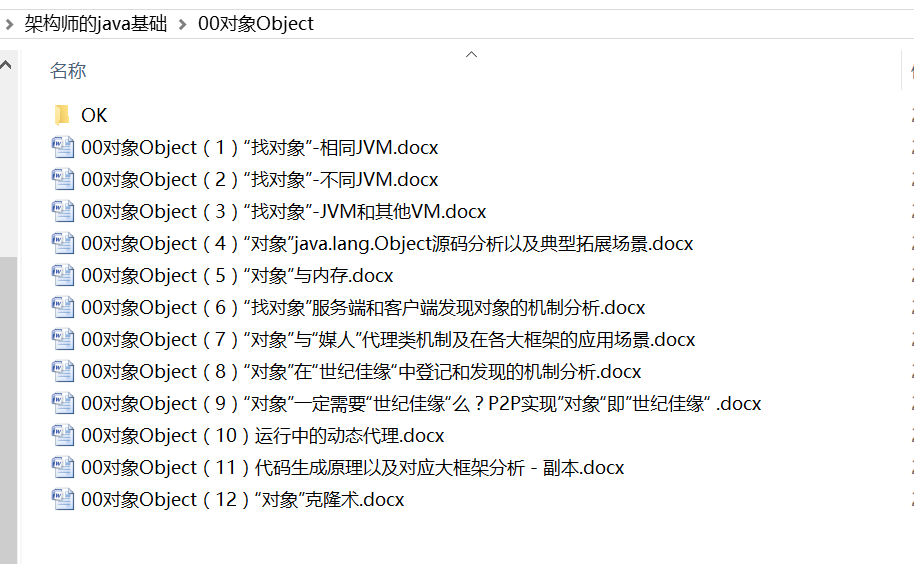

## 类定义
源码如下:
```
public class JSONObject extends JSON implements Map<String, Object>, Cloneable, Serializable, InvocationHandler {

```
### JSON
    
### InvocationHandler


    “在java的动态代理机制中，有两个重要的类或接口，一个是 InvocationHandler(Interface)、另一个则是 Proxy(Class)”
    通过《架构师的java基础\00对象Object》系列文章就知道，代理的本质是：“做媒婆”  集中提供一些额外的附属的功能。让“对象”看起来更加完美。
    
        
      
    此处的动态代理的价值：为了提供更多“序列化方式”，具体参考本系列的“序列化方式”章节

```
public Object invoke(Object proxy, Method method, Object[] args) throws Throwable {
        Class<?>[] parameterTypes = method.getParameterTypes();
        if (parameterTypes.length == 1) {
            if (method.getName().equals("equals")) {
                return this.equals(args[0]);
            }
            
            Class<?> returnType = method.getReturnType();
            if (returnType != void.class) {
                throw new JSONException("illegal setter");
            }

            String name = null;
            JSONField annotation = method.getAnnotation(JSONField.class);
            if (annotation != null) {
                if (annotation.name().length() != 0) {
                    name = annotation.name();
                }
            }

            if (name == null) {
                name = method.getName();
                
                if (!name.startsWith("set")) {
                    throw new JSONException("illegal setter");
                }

                name = name.substring(3);
                if (name.length() == 0) {
                    throw new JSONException("illegal setter");
                }
                name = Character.toLowerCase(name.charAt(0)) + name.substring(1);
            }

            map.put(name, args[0]);
            return null;
        }

        if (parameterTypes.length == 0) {
            Class<?> returnType = method.getReturnType();
            if (returnType == void.class) {
                throw new JSONException("illegal getter");
            }

            String name = null;
            JSONField annotation = method.getAnnotation(JSONField.class);
            if (annotation != null) {
                if (annotation.name().length() != 0) {
                    name = annotation.name();
                }
            }

            if (name == null) {
                name = method.getName();
                if (name.startsWith("get")) {
                    name = name.substring(3);
                    if (name.length() == 0) {
                        throw new JSONException("illegal getter");
                    }
                    name = Character.toLowerCase(name.charAt(0)) + name.substring(1);
                } else if (name.startsWith("is")) {
                    name = name.substring(2);
                    if (name.length() == 0) {
                        throw new JSONException("illegal getter");
                    }
                    name = Character.toLowerCase(name.charAt(0)) + name.substring(1);
                } else if (name.startsWith("hashCode")) {
                    return this.hashCode();
                } else if (name.startsWith("toString")) {
                    return this.toString();
                } else {
                    throw new JSONException("illegal getter");
                }
            }
            
            Object value = map.get(name);
            return TypeUtils.cast(value, method.getGenericReturnType(), ParserConfig.getGlobalInstance());
        }

        throw new UnsupportedOperationException(method.toGenericString());
    }
```

### Serializable：
本质上传输还是通过java.io.Serializable进行
### Cloneable

```
    @Override
    public Object clone() {
        return new JSONObject(map instanceof LinkedHashMap //
                              ? new LinkedHashMap<String, Object>(map) //
                                  : new HashMap<String, Object>(map)
                                  );
    }
```

1. 使用了浅复制的方式克隆json对象。
2. 什么时候这个方法被调用？　
 

### 重写了equals以及hashCode
    都是针对map的操作


## 构造函数

```
   public JSONObject(){
        this(DEFAULT_INITIAL_CAPACITY, false);
    }

    public JSONObject(Map<String, Object> map){
        this.map = map;
    }

    public JSONObject(boolean ordered){
        this(DEFAULT_INITIAL_CAPACITY, ordered);
    }

    public JSONObject(int initialCapacity){
        this(initialCapacity, false);
    }

    public JSONObject(int initialCapacity, boolean ordered){
        if (ordered) {
            map = new LinkedHashMap<String, Object>(initialCapacity);
        } else {
            map = new HashMap<String, Object>(initialCapacity);
        }
    }

```

以上构造函数所有的工作都是围绕Map进行
可以构造成2类的Map，通过ordered来确定
LinkedHashMap
HashMap（默认）


 
## 关键类成员
###  private final Map<String, Object> map;
####  用LinkedHashMap以及HashMap存放键值对
    通过分析LinkedHashMap以及HashMap源码可以得到2者的主要差异：LinkedHashMap 是HashMap的一个子类，保存了记录的插入顺序，在用Iterator遍历LinkedHashMap时，先得到的记录肯定是先插入的.也可以在构造时用带参数，按照应用次数排序。
    在遍历的时候会比HashMap慢，不过有种情况例外，当HashMap容量很大，实际数据较少时，遍历起来可能会比LinkedHashMap慢，因为LinkedHashMap的遍历速度只和实际数据有关，和容量无关，而HashMap的遍历速度和他的容量有关。
    
#### 一个问题
    如何保证线程安全？
    后续查看jackson中如何保证这方面

### get系列
    获取对象。
    可以得到如下类型对象
    泛型T :普通的javabean
    JSONObject：让json可以嵌套
    JSONArray：让json数组可以嵌套
    Object： 需要强制转换的javabean   ，也是很多get系列方法的公共方法
    其中TypeUtils以及Type在fastjson中的应用，见“动态类”
    
    以及基本对象类型，如图：

    
### put系列
    设置对象。
    public Object put(String key, Object value) 
    public JSONObject fluentPut(String key, Object value)
    public void putAll(Map<? extends String, ? extends Object> m)
    public JSONObject fluentPutAll(Map<? extends String, ? extends Object> m) 
    顾名思义，不做详述
    
##  非关键成员
  
  非核心作用，不详述 。基本都是map的操作。
1. public int size()
2. public boolean isEmpty()
3. public boolean containsKey(Object key) 
4. public boolean containsValue(Object value)
5. public void clear() 
6. public JSONObject fluentClear()
7. public Object remove(Object key) 
8. public JSONObject fluentRemove(Object key)
9. public Set<String> keySet()
10. public Collection<Object> values()
11. public Set<Map.Entry<String, Object>> entrySet()
12. 

    