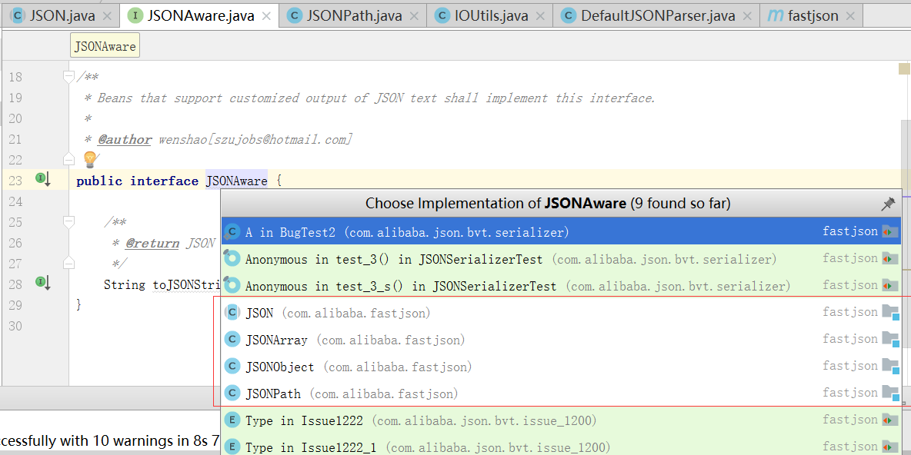

## 2个类有类似的实现



##  JSONAware

```
public interface JSONAware {

    /**
     * @return JSON text
     */
    String toJSONString();
}
```


##  JSONStreamAware

```
    void writeJSONString(Appendable out) throws IOException;

```


##  用户不用关注