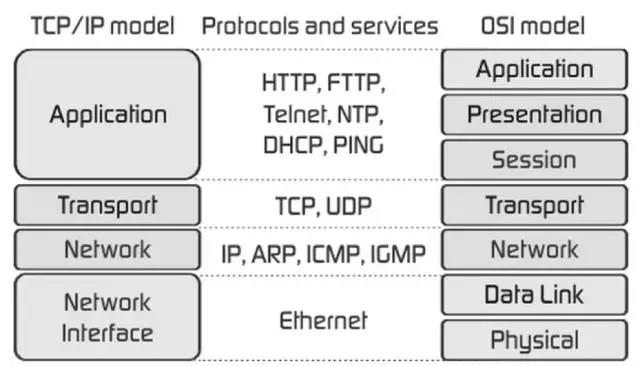

# 网络协议
# OSI
## 7层：
    物理层、数据链路层、网络层、传输层、会话层、表示层和应用层
    
    因为复杂度高  没有得到很好的推广
## 更多信息请查阅相关书籍

# TCP-IP
## OSI的浓缩（延伸）
## 因为复杂度低，应用比OSI广泛
## 4层；
#### 网络接口层
      物理层+数据链路层
#### 网络层 
#### 传输层 
#### 应用层
      会话层+表示层+应用层

# 对比图谱

# 