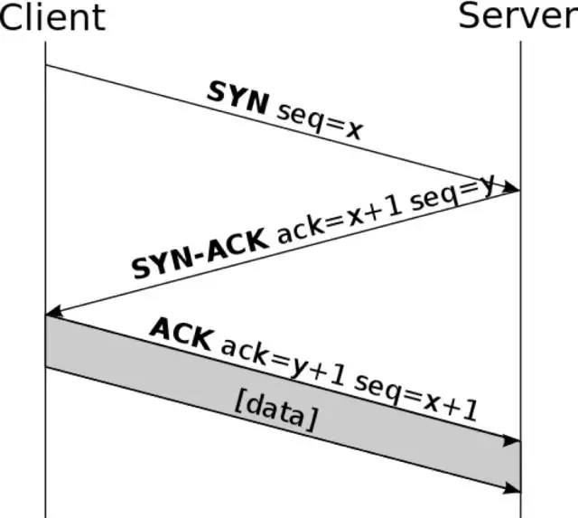

## 3次握手建立连接

  TCP通过三次握手的连接创建机制确保连接的可靠性。
01
SYN
      客户端发送包含同步序列号的SYN报文，并且同时传递一个随机数作为顺序号。为了方便描述，我们将该顺序号设为x。

02
SYN-ACK
服务端在接收到请求之后，返回SYN-ACK报文作为应答。并且同时传递一个值为x+1的应答号以及另一个随机数作为服务端的序列号。同样，为了方便描述，我们将应答号设为x+1，服务端序列号设为y。

03
ACK
客户端接收到服务端的应答后，分别将y+1与x+1作为应答号和序列号再次发送至客户端。

## 4次握手关闭连接

## todo：过程分析

