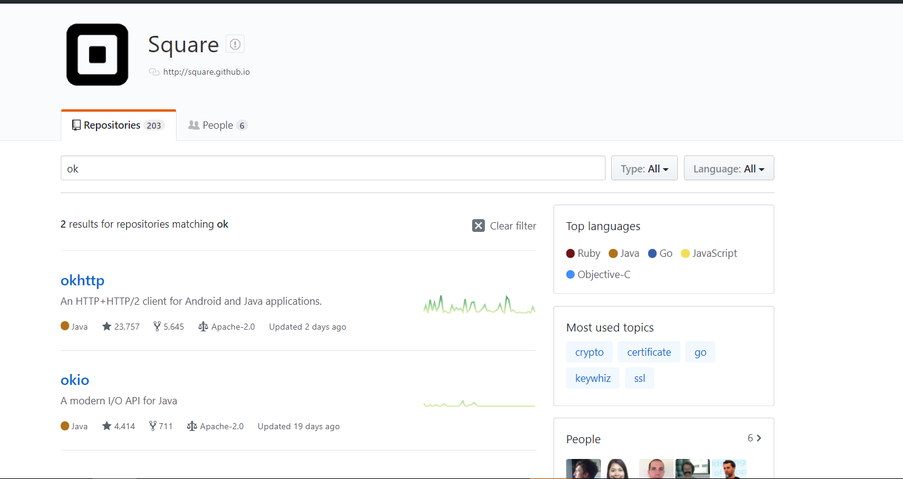

#   分布式链路追踪系统

##  zipkin

使用了okhttp做基础的IO
```
      <dependency>
        <groupId>com.squareup.okhttp3</groupId>
        <artifactId>okhttp</artifactId>
        <version>${okhttp.version}</version>
      </dependency>

      <dependency>
        <groupId>com.squareup.okhttp3</groupId>
        <artifactId>mockwebserver</artifactId>
        <version>${okhttp.version}</version>
      </dependency>
```

然后找到 IO是OKIO

```
 <dependency>
        <groupId>com.squareup.okio</groupId>
        <artifactId>okio</artifactId>
        <version>${okio.version}</version>
      </dependency>
```

都是美国支付公司square的开源组件



##  cat（点评）


#   elk
#   